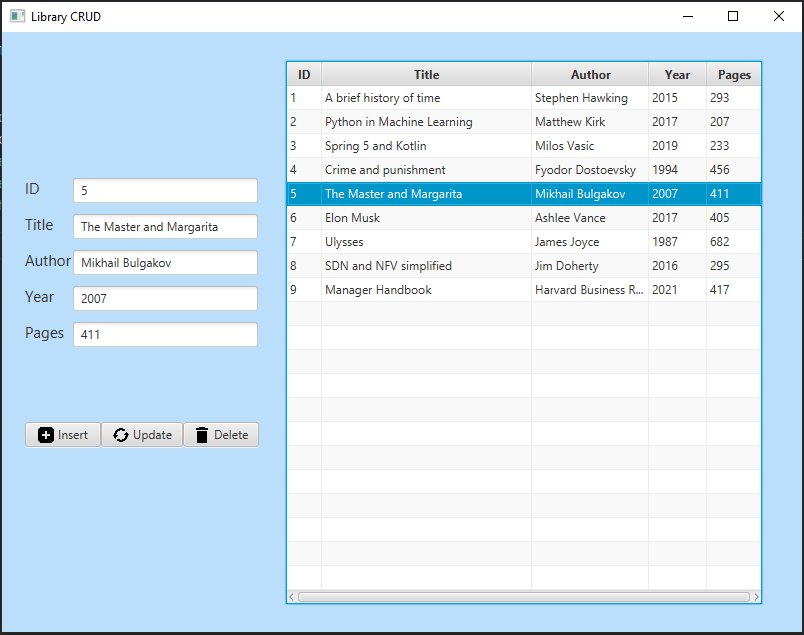

# JavaFX Simple CRUD

Code is based upon [this tutorial](https://youtu.be/CGWRwpeihE8), but extends it with "cleanest architecture" by *service* and *repository* layers addition.

## Motivation

This is the first project of my adventure with JavaFX.

Codebase presented here forms the basis for any CRUD application.

## Project Status

As for now repository layer uses the localhost MySQL server.

I am looking forward to use REST API as a repository.

## Technology Stack

- Java 17

- Maven
- JavaFX
- MySQL
